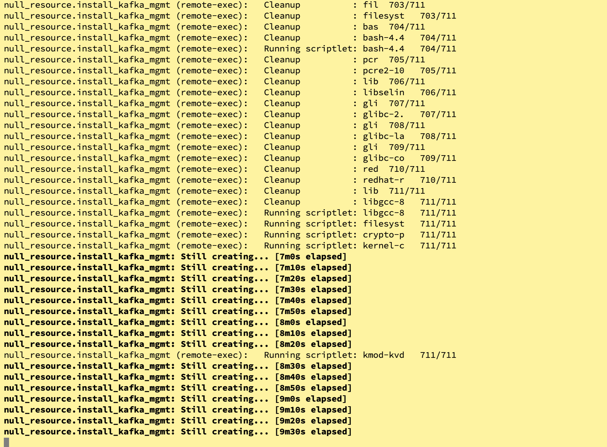
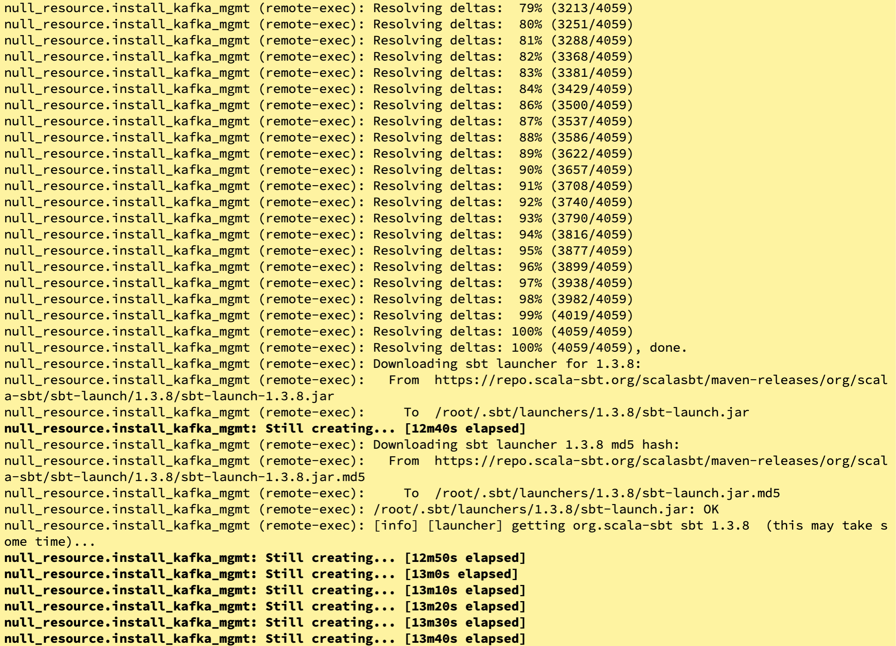
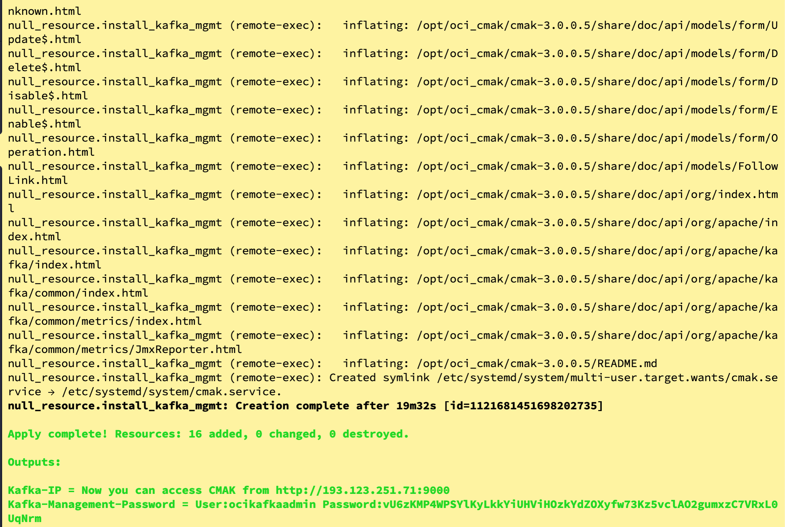
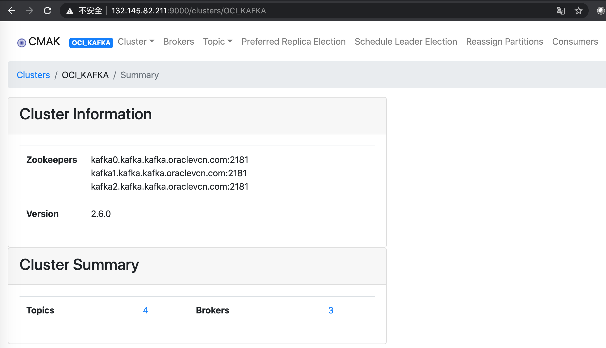
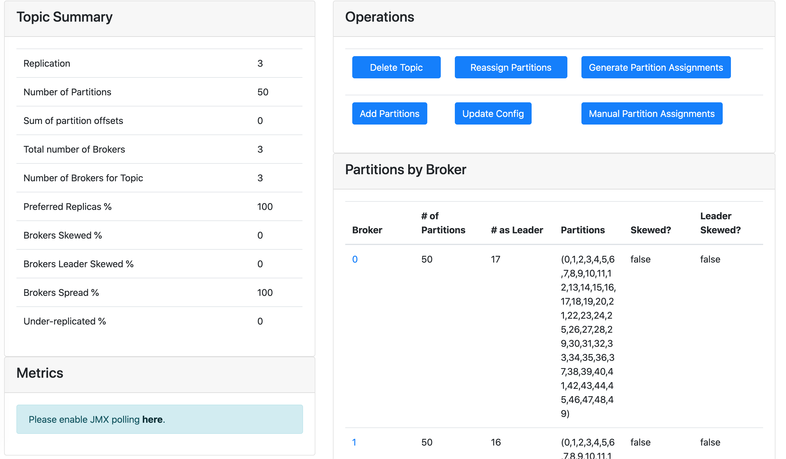
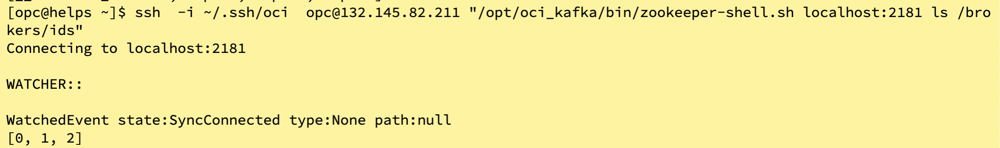
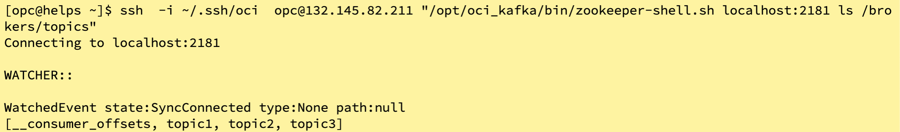
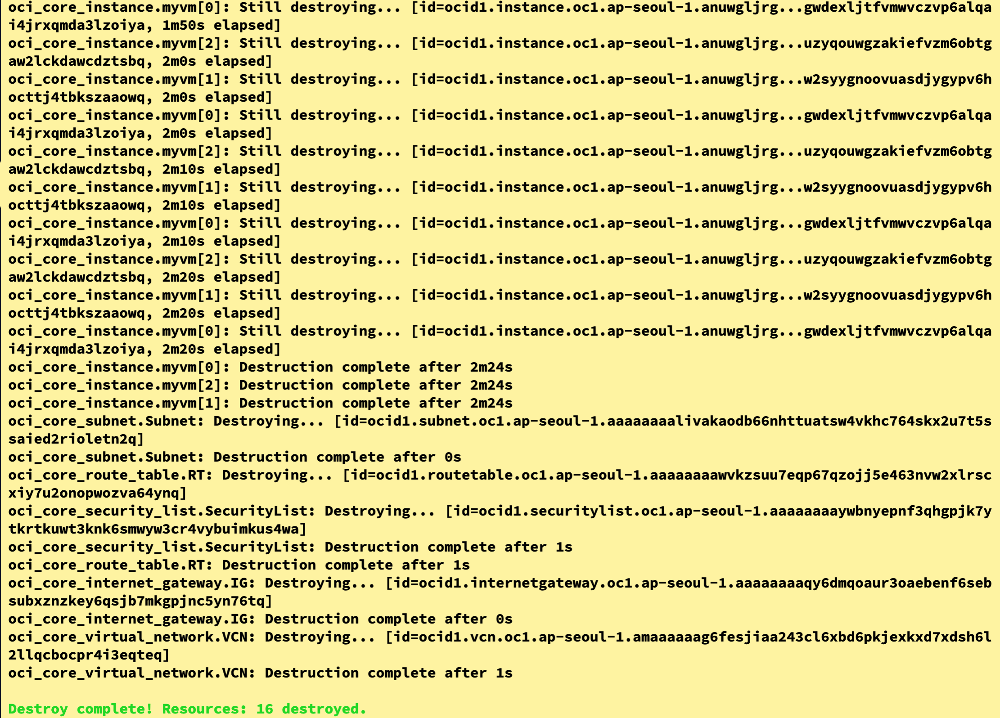
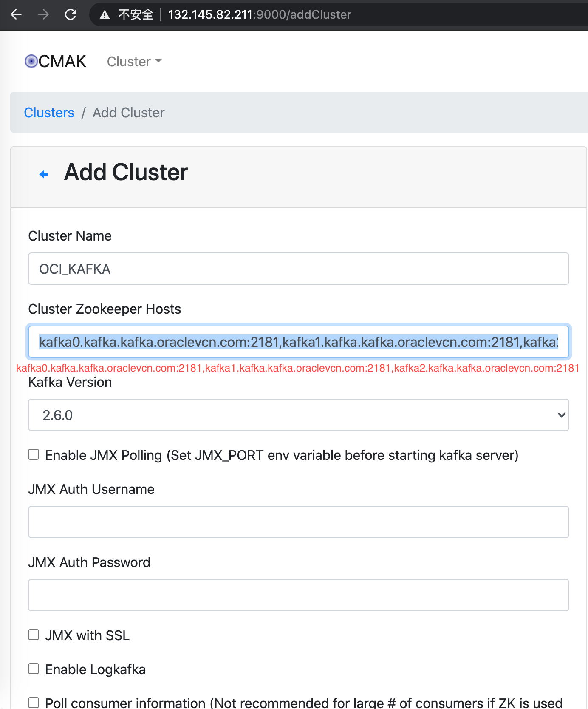
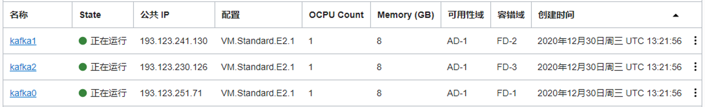

# oci-kafka-cluster
这个脚本是为了部署kafka-cluster

## 前提条件
需要在OCI上获取一些参数用来terraform与OCI连接。参考：[here](https://github.com/oracle/oci-quickstart-prerequisites).

## 下载terraform脚本
可以通过github上的下载按钮下载到本地解压缩。 也可以通过以下命令行操作：

    git clone https://github.com/ocitiger/oci-kafka-cluster.git
    cd oci-kafka-cluster/terraform
    ls

## 配置基本参数
当前目录应该是oci-kafka-cluster/terraform，该目录下有一个配置文件terraform.tfvars,应该需要配置如下参数，该参数如何获取参见“前提条件”

    tenancy_ocid = "ocid1.tenancy.oc1....."
    user_ocid = "ocid1.user.oc1....."
    fingerprint= "xx:xx:xx:xx:xx:xx:xx:xx:xx:xx:xx:xx:xx:xx:xx:xx"
    private_key_path = "/path/oci_api_key_public.pem"
    region = "ap-seoul-1" # region
    compartment_ocid = "ocid1.compartment.oc1....."
    ssh_public_key="ssh-rsa AAA... ... xxx@localhost"


## 初始化，计划，执行Terraform

    terraform init  ;   terraform  plan  ;   terraform  apply --auto-approve

该terraform脚本会安装zookeeper集群、kafka集群以及CMAK，CMAK安装过程会比较慢，大约需要十几分钟，如果看到如下的输出，其实kafka已经安装好了。熟悉OCI的同学可以直接忽略这一步，测试kafka集群:





完全安装好参见下图：



## 测试kafka集群


`ssh -i <the key you used> opc@<public IP of the KAFKA instance>`

访问CMAK操作KAFKA Cluster：







也可以查看KAFKA中ZOOKEEPER的信息：

```
[opc@helps ~]$ ssh  -i ~/.ssh/oci  opc@<public IP of the KAFKA instance> "/opt/oci_kafka/bin/zookeeper-shell.sh localhost:2181 ls /brokers/ids"
Connecting to localhost:2181

WATCHER::

WatchedEvent state:SyncConnected type:None path:null
[0, 1, 2]

```




可以直接执行KAFKA命令：

```
[opc@helps ~]$ ssh  -i ~/.ssh/oci  opc@<public IP of the KAFKA instance> "/opt/oci_kafka/bin/kafka-topics.sh --create --bootstrap-server kafka0.kafka.kafka.oraclevcn.com:9092,kafka1.kafka.kafka.oraclevcn.com:9092,kafka2.kafka.kafka.oraclevcn.com:9092 --replication-factor 3 --partitions 6 --topic topic3"
Created topic topic3.

```

当然可以可以通过检查zookeeper来查看KAFKA的topic

```
[opc@helps ~]$ ssh  -i ~/.ssh/oci  opc@<public IP of the KAFKA instance> "/opt/oci_kafka/bin/zookeeper-shell.sh localhost:2181 ls /brokers/topics"
Connecting to localhost:2181

WATCHER::

WatchedEvent state:SyncConnected type:None path:null
[__consumer_offsets, topic1, topic2, topic3]

```





## 销毁Terraform 资源


    terraform destroy --auto-approve





## 备注
CMAK中手动添加kafka cluster


查看OCI中kafka的节点


